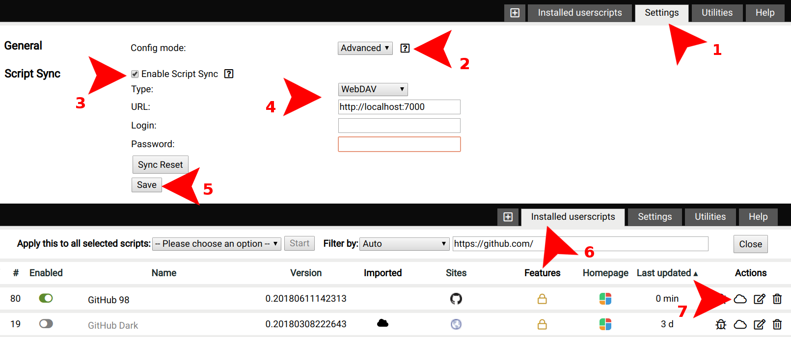
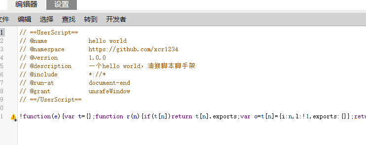
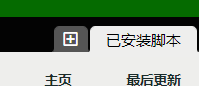
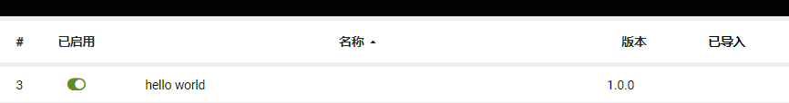

# Vue生产环境（production） Devtools 调试 

使用本脚本，在生产环境也可以使用Vue Devtools调试你的项目，支持Vue2、Vue3

使用方法：    
**方法1**  
在你的vue项目，按F12打开控制台，复制dist/main.js中的内容执行  
**方法2**  
（1）在浏览器安装 [tampermonkey](https://www.tampermonkey.net/) 插件  
（2）去[greasyfork](https://greasyfork.org/zh-CN/scripts/443634-vue%E7%94%9F%E4%BA%A7%E7%8E%AF%E5%A2%83-production-devtools-%E8%B0%83%E8%AF%95)安装脚本  

## 开发

如果修改了`header/index.ts`，需要执行`npm run build:header`编译一下头

代码在`src/index.ts`中

## 热部署

1.先执行 `npm run build` 编译一次，编译结果为 `dist/main.js`

2.执行 `npm run start:server` 启动 `http://localhost:7000`服务

默认用户名/密码为`derjanb / secret`

在油猴中设置

3.点 + ，把第1步编译的结果`dist/main.js`粘贴进去 保存

4.执行 `npm run sync`，现在每次更新就会自动同步到油猴中了，不需要手动粘贴！

## 发布

执行 `npm run build` 编译最新的文件
