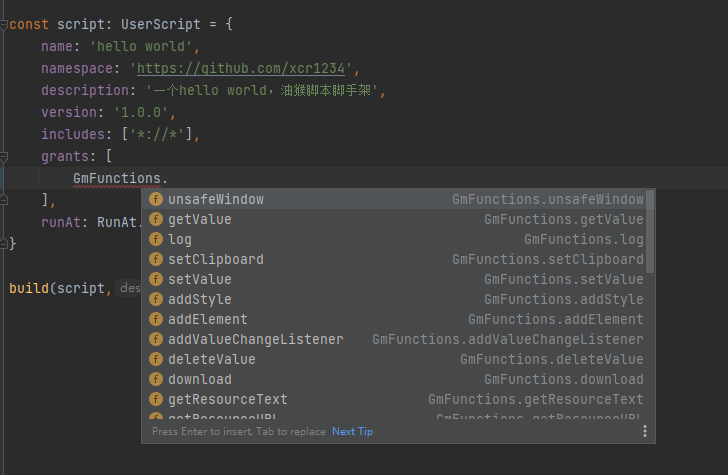
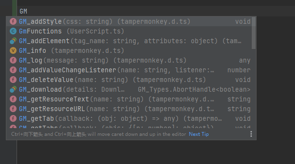

# 油猴脚本脚手架 

特性
- TypeScript完全支持
- 热更新部署 每次更新会自动同步到油猴中，不需要手动复制粘贴！


## 使用方式

clone本项目，然后执行npm install

## 开发

一个完整的油猴脚本格式如下

```javascript
// ==UserScript==

// 这部分是头部区域，一般来说不会经常修改

// ==/UserScript==

// 这里是正文，也就是脚本的执行部分，是需要经常修改的
console.log('hello world')
```

## 头部区域

头部区域的开发是在`header/index.ts`，使用了typescript，这样会有IDE完全支持，而不是单纯的写几个注释




开发完毕后执行`npm run build:header`编译

## 正文

正文开发是在`src/index.ts`，在开发时，如果使用到`GM_`相关函数，有完整的声明支持：




## 热部署

1.先执行 `npm run build` 编译一次，编译结果为 `dist/main.js`

2.执行 `npm run start:server` 启动 `http://localhost:7000`服务

默认用户名/密码为`derjanb / secret`

在油猴中设置


3.点 + ，把第1步编译的结果`dist/main.js`粘贴进去 保存


4.执行 `npm run sync`，现在每次更新就会自动同步到油猴中了，不需要手动粘贴！

## 发布

执行 `npm run build` 编译最新的文件
