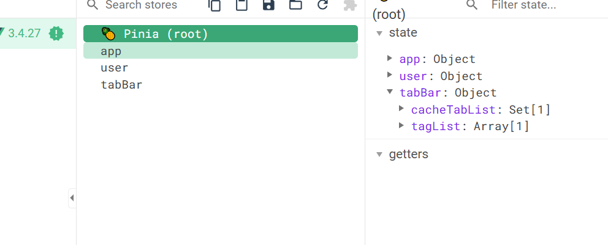

# Vue生产环境（production） Devtools 调试

使用本脚本，在生产环境也可以使用Vue Devtools调试你的项目，支持Vue2、Vue3  
1.1版本对hook方式进行了重写，结构更清晰  
**2.0版本用vite重新编译，vue3去除vuex，改用pinia**

正常情况下，开启成功后，控制台会显示：，并且可以使用Vue Devtools(vue2)和pinia(vue3):

使用方法：    
**方法1**  
在你的vue项目，按F12打开控制台，复制dist/main.js中的内容执行  
**方法2**  
（1）在浏览器安装 [tampermonkey](https://www.tampermonkey.net/) 插件  
（2）去[greasyfork](https://greasyfork.org/zh-CN/scripts/443634-vue%E7%94%9F%E4%BA%A7%E7%8E%AF%E5%A2%83-production-devtools-%E8%B0%83%E8%AF%95)安装脚本

## 开发

https://github.com/xcr1234/tampermonkey-typescript

